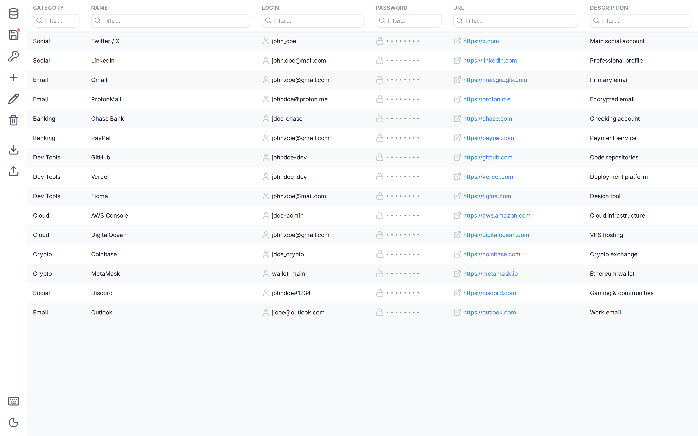
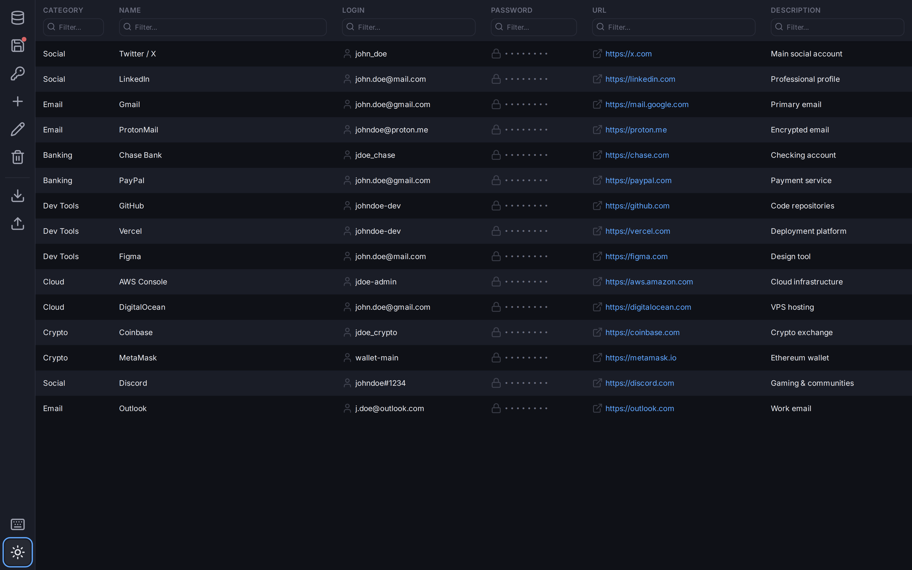
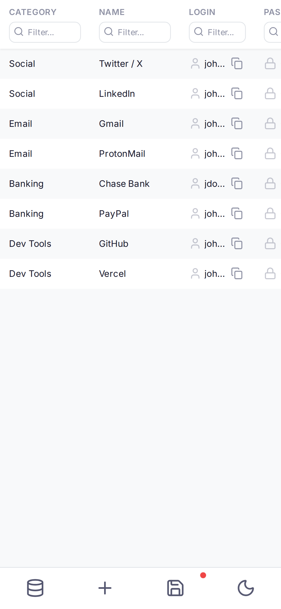

# Password Manager

A self-hosted, encrypted password manager built with Vue 3. Store your passwords securely in LocalStorage, GitHub, WebDAV, or Google Drive with zero-knowledge AES-256 encryption.





<details>
<summary>📱 Mobile View</summary>



</details>

## Features

- **AES-256-GCM encryption** — passwords encrypted client-side with PBKDF2 key derivation (100k iterations)
- **Multiple storage backends** — LocalStorage, GitHub repository, WebDAV server, or Google Drive (appDataFolder)
- **Multi-repo sync** — save to multiple repositories simultaneously
- **Dark theme** — automatic system detection + manual toggle
- **PWA** — install as a native app on any device
- **Auto-lock** — automatic session lock after 5 minutes of inactivity
- **Password generator** — configurable length, character sets, strength indicator
- **Password masking** — passwords hidden in table, reveal on demand with auto-hide
- **Clipboard copy** — one-click copy for logins and passwords
- **Import/Export** — backup and restore your database as JSON
- **Keyboard shortcuts** — `Ctrl+S` save, `Ctrl+N` new entry
- **Responsive design** — works on desktop, tablet, and mobile
- **URL sharing** — share repository config via URL parameters

## Tech Stack

- **Vue 3** + Composition API + `<script setup>`
- **Pinia** — state management (split stores: database + repos)
- **TypeScript** — strict mode across entire codebase
- **Vite 6** — fast builds with HMR
- **UnoCSS** — atomic CSS with custom design tokens
- **Lucide Icons** — clean, consistent icon set
- **Vitest** — 74 unit tests (crypto, lib, stores, FileSystemDriver, GoogleDriveClient)
- **Web Crypto API** — native browser encryption (AES-256-GCM + PBKDF2)

## Getting Started

### Prerequisites

- Node.js 18+
- npm 9+

### Install & Run

```bash
# Install dependencies
npm install

# Start development server
npm run dev

# Build for production
npm run build

# Run unit tests
npm run test

# Lint & format
npm run lint
npm run format
```

## Usage

### 1. Add a Repository

On first launch, the Repository Settings modal appears. Choose a storage backend:

| Backend | Description |
|---------|-------------|
| **LocalStorage** | Built-in, no setup needed. Data stored in browser. |
| **GitHub** | Store encrypted database in a GitHub repository. Requires a Personal Access Token with `repo` scope. |
| **WebDAV** | Store on any WebDAV server (Nextcloud, ownCloud, etc.) |
| **Google Drive** | Store in Google Drive's hidden appDataFolder. Requires an OAuth 2.0 Client ID. |

### 2. Set Master Password

Enter your master password in the Repository Settings modal. This password encrypts/decrypts your entire database. **It is never stored or transmitted.**

### 3. Connect & Manage

Click **Connect** to unlock the database. Then:

- **Add** — create new password entries
- **Edit** — double-click a row or select + Edit
- **Delete** — select a row + Delete (with confirmation)
- **Save** — persist changes to the repository
- **Filter** — type in any column header to filter entries
- **Copy** — click the copy icon on login/password cells

## Security

| Aspect | Implementation |
|--------|---------------|
| Encryption | AES-256-GCM (Web Crypto API) |
| Key Derivation | PBKDF2 with 100,000 iterations, random salt |
| Zero Knowledge | Master password never leaves the browser |
| Auto-lock | Session clears after 5 min inactivity |
| Legacy Support | Auto-detects and migrates old 3DES format to AES-256 |
| Google Drive | Data stored in appDataFolder — only this app can access the files |

## Google Drive Setup

To use Google Drive as a storage backend:

1. Go to [Google Cloud Console](https://console.cloud.google.com/)
2. Create a new project (or select an existing one)
3. Enable the **Google Drive API** in **APIs & Services → Library**
4. Go to **APIs & Services → Credentials** → **Create Credentials → OAuth Client ID**
5. Select **Web application** as the application type
6. Add your app's URL to **Authorized JavaScript origins** (e.g. `http://localhost:5173` for development, `https://yourdomain.com` for production)
7. Copy the **Client ID** (format: `123456789.apps.googleusercontent.com`)
8. In the app, create a new repository with type **Google Drive** and paste the Client ID
9. On first connect, a Google OAuth popup will appear — grant access to the app data folder

> **Note:** The app only requests the `drive.appdata` scope, which limits access to a hidden app-specific folder. Your other Google Drive files are never accessible to this app.

## Deployment

### GitHub Pages

The project includes a GitHub Actions workflow (`.github/workflows/deploy.yml`) that automatically builds and deploys to GitHub Pages on push to `main`.

### Self-Hosted

```bash
npm run build
# Serve the `docs/` directory with any static file server
```

## Project Structure

```
src/
├── main.ts              # App entry point
├── App.vue              # Main layout (sidebar + data table)
├── crypto.ts            # AES-256-GCM encryption + PBKDF2
├── lib.ts               # Utilities (debounce, file save)
├── FileSystemDriver.ts  # GitHub/WebDAV/LocalStorage/Google Drive adapters
├── GoogleDriveClient.ts  # GIS auth + Drive REST API (no gapi/SDK)
├── stores/
│   ├── database.ts      # Database state + CRUD operations
│   └── repos.ts         # Repository management
├── styles/
│   ├── tokens.css       # Design tokens (colors, spacing, etc.)
│   ├── base.css         # Global reset + typography
│   └── main.css         # Style entry point
└── components/
    ├── BaseModal.vue     # Reusable modal with focus trap
    ├── NotificationToast.vue  # Toast notification system
    ├── repo_window.vue   # Repository settings (split-view)
    ├── edit_window.vue   # Entry editor + password generator
    ├── forms.vue         # Dynamic form renderer
    ├── form_component.vue # Individual form field
    └── loader.vue        # Loading overlay
```

## License

MIT